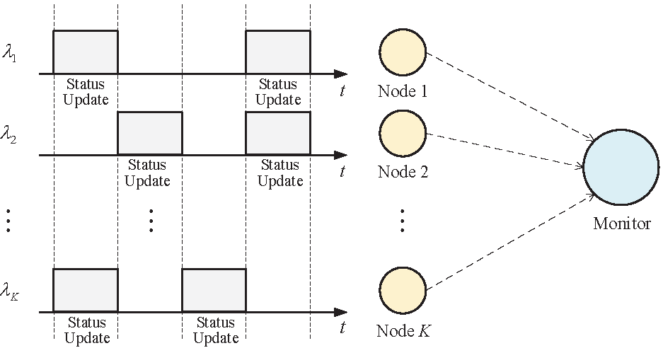
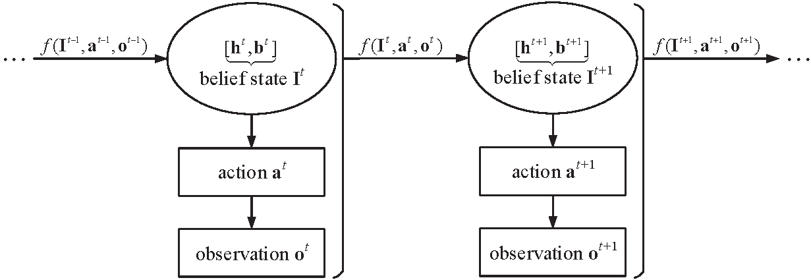

# Age-of-Information-based Scheduling in Multiuser Uplinks with Stochastic Arrivals: A POMDP Approach

[Aoyu Gong*](https://aygong.com/), Tong Zhang*, [He Chen](http://iiotc.ie.cuhk.edu.hk/), Yijin Zhang

[`IEEE`](https://ieeexplore.ieee.org/document/9348022) | [`arXiv`](https://arxiv.org/pdf/2005.05443.pdf) | [`BibTeX`](#Citation) | [`Related Work`](https://aygong.com/globecom20.html)

<div align="center">
<p>
 &nbsp;&nbsp;&nbsp;&nbsp;  
</p>
</div>


<table>
<tr><td><em>
Figures: The multiuser uplink system with stochastic arrivals of status updates, and an illustration of belief states, actions, observations, and the update of belief states.
</em></td></tr>
</table>

In this paper, we consider a multiuser uplink status update system, where a monitor aims to timely collect randomly generated status updates from multiple end nodes through a shared wireless channel. We adopt the recently proposed metric, termed age of information (AoI), to quantify the information timeliness and freshness. Due to the random generation of the status updates at the end node side, the monitor only grasps a partial knowledge of the status update arrivals. Under such a practical scenario, we aim to address a fundamental multiuser scheduling problem: how to schedule the end nodes to minimize the network-wide AoI? To solve this problem, we formulate it as a partially observable Markov decision process (POMDP), and develop a dynamic programming (DP) algorithm to obtain the optimal scheduling policy. By noting that the optimal policy is computationally prohibitive, we further design a low-complexity myopic policy that only minimizes the one-step expected reward. Simulation results show that the performance of the myopic policy approaches that of the optimal policy and is superior to that of the baseline policy.


## Configuration

You can reproduce our experiments using **MATLAB R2021a**.

- Clone the repository: `git clone https://github.com/aygong/aoi-scheduling-pomdp.git`
- Run the script: `aoi_main.m` 

> The code may be compatible with the previous versions of MATLAB.


## Folder Structure

```bash
./aoi-scheduling-pomdp/
├── README.md
|
├── aoi_main.m
├── sigl_func.m    # Compute the POMDP functions of each end node
├── beli_prod.m    # Generate the finite sets of belief states
├── dp_theo.m      # Analyze the optimal policy (partial knowledge)
├── dp_simu.m      # Simulate the optimal policy (partial knowledge)
├── mpp_theo.m     # Analyze the myopic policy (partial knowledge)
├── mpp_simu.m     # Simulate the myopic policy (partial knowledge)
├── mpf_simu.m     # Simulate the myopic policy (full knowledge)
├── map_simu.m     # Simulate the MaxAoI policy
└── rdp_simu.m     # Simulate the randomized policy
```


## Citation

If you find the code helpful, please consider citing our paper:

```
@INPROCEEDINGS{gong2020age,
  title={{Age-of-information-based scheduling in multiuser uplinks with stochastic arrivals: A POMDP approach}},
  author={Gong, Aoyu and Zhang, Tong and Chen, He and Zhang, Yijin},
  booktitle={Proc. IEEE GLOBECOM},
  pages={1--6},
  year={2020},
}
```
